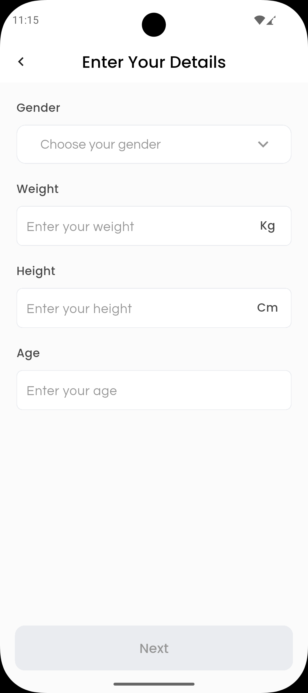
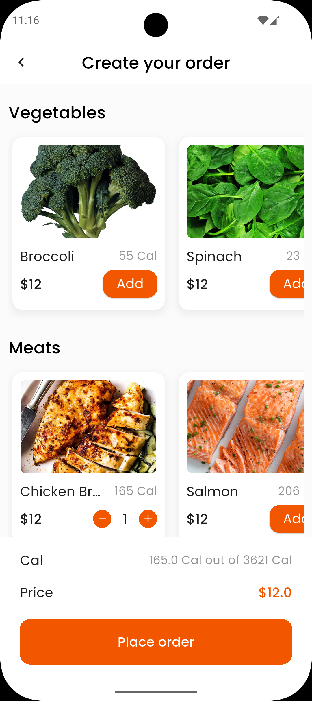

# Balanced Meal 🍽️

A Flutter ordering application for Balanced Meal, a unique meal prep restaurant that lets you customize your meals by selecting specific ingredients based on their nutritional facts. The app helps users create personalized, balanced meals while staying within their daily calorie requirements based on their individual health metrics.

## Features ✨

- **Personalized Nutrition**: Calculate daily calorie needs based on age, gender, weight, and height
- **Custom Meal Building**: Select ingredients from Balanced Meal's menu across three categories:
  - 🥬 Vegetables
  - 🥩 Meats  
  - 🍞 Carbohydrates
- **Real-time Tracking**: Monitor calories and pricing as you build your meal order
- **Order Management**: Review and confirm your meal selections before placing order
- **Smart Recommendations**: Stay within healthy calorie limits with built-in guidance
- **Beautiful UI**: Modern, responsive design with custom fonts and smooth animations

## Screenshots 📱

<div align="center">
  
  
  
  
</div>

*Welcome Screen → User Details → Create Order → Order Summary*

## Tech Stack 🛠️

- **Framework**: Flutter 3.7.2+
- **State Management**: BLoC/Cubit pattern
- **UI**: Custom responsive design with ScreenUtil
- **Data**: JSON-based food database
- **Fonts**: Custom font families (Poppins, Abhaya Libre, Questrial)`

## Getting Started 🚀

### Prerequisites

- Flutter SDK 3.7.2 or higher
- Dart 3.0+
- Android Studio / VS Code
- Android SDK / Xcode (for platform-specific builds)

### Installation

1. **Clone the repository**

   ```bash
   git clone https://github.com/Akuma-0/Balanced-Meal.git
   cd balanced_meal
   ```

2. **Install dependencies**

   ```bash
   flutter pub get
   ```

3. **Generate code**

   ```bash
   flutter packages pub run build_runner build
   ```

4. **Run the app**

   ```bash
   flutter run
   ```

## App Structure 📁

```text
lib/
├── main.dart                    # App entry point
├── balanced_meal_app.dart       # Main app configuration
├── core/                        # Core utilities and widgets
│   ├── helpers/                 # Helper functions
│   ├── networking/              # Network related code
│   ├── routing/                 # App routing configuration
│   ├── theming/                 # Colors, styles, themes
│   └── widgets/                 # Reusable UI components
├── cubit/                       # State management
│   ├── app_cubit.dart          # Main app state logic
│   └── app_cubit_state.dart    # State definitions
├── features/                    # Feature-based modules
│   ├── welcome/                 # Welcome screen
│   ├── user_details/           # User input forms
│   ├── create_order/           # Meal creation interface
│   └── order_summery/          # Order review screen
└── models/                      # Data models
    ├── food_base.dart          # Base food model
    ├── carp_food.dart          # Carbohydrate model
    ├── meat_food.dart          # Meat model
    └── vegetable_food.dart     # Vegetable model
```

## How It Works 🔄

1. **Welcome Screen**: Introduction to Balanced Meal's custom ordering system
2. **User Details**: Input personal information (age, gender, height, weight) for personalized nutrition
3. **Calorie Calculation**: App calculates your daily calorie needs using BMR formula
4. **Menu Selection**: Browse Balanced Meal's ingredient menu across different food categories
5. **Custom Meal Building**: Add ingredients to create your personalized meal with real-time nutrition tracking
6. **Order Summary**: Review your custom meal selections and total cost before placing order

## Calorie Calculation 🧮

The app uses the Mifflin-St Jeor equation to calculate Basal Metabolic Rate (BMR):

**For Men**: BMR = 666.47 + (13.75 × weight) + (5 × height) - (6.75 × age)
**For Women**: BMR = 655.1 + (9.56 × weight) + (1.85 × height) - (4.67 × age)

## Food Data 📊

The app includes nutritional information for various foods stored in JSON format:

- `assets/data/vegetable.json` - Vegetable nutritional data
- `assets/data/meat.json` - Meat nutritional data  
- `assets/data/carb.json` - Carbohydrate nutritional data

## Support 💬

If you encounter any issues or have questions, please:

1. Check the [Issues](https://github.com/Akuma-0/Balanced-Meal/issues) page
2. Create a new issue if your problem isn't already listed
3. Provide detailed information about your environment and the issue

---

Made with ❤️ by [Akuma-0](https://github.com/Akuma-0)
